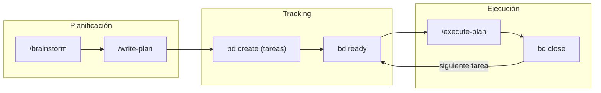
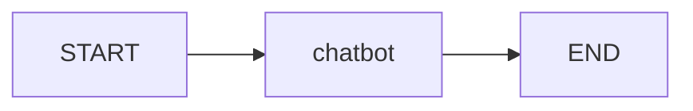
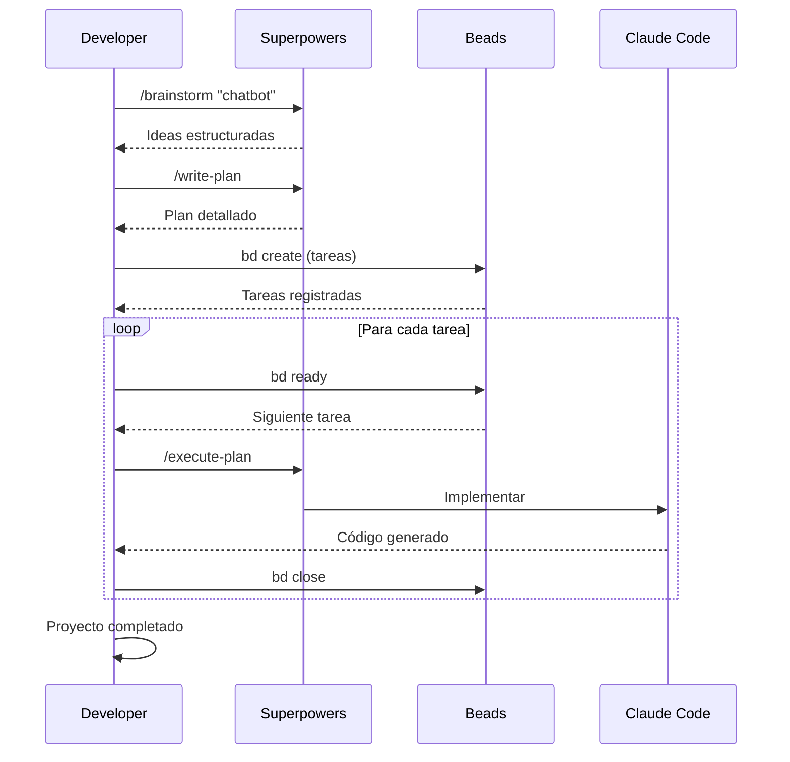

¿Quieres ver cómo se siente desarrollar con Claude Code usando **Beads** para gestionar tareas y **Superpowers** para planificar? En este tutorial construimos un chatbot conversacional desde cero, mostrando el flujo completo.

## El reto

Crear un **chatbot conversacional** con:
- **LangGraph** para el backend con estado
- **Chainlit** para la UI web
- **Azure OpenAI GPT 5.1** como modelo
- **UV** como gestor de paquetes moderno

Todo esto usando Claude Code con Beads + Superpowers para gestionar el desarrollo.

## La sinergia: Beads + Superpowers



**Superpowers** te ayuda a planificar: generar ideas, estructurar el plan, ejecutarlo paso a paso.

**Beads** mantiene el estado del trabajo: qué está pendiente, qué bloquea qué, qué ya se completó.

Juntos, te dan un flujo de desarrollo **estructurado y persistente**.

## Prerrequisitos

### Entorno necesario

- Claude Code instalado
- Python 3.11+
- UV (gestor de paquetes)
- Azure CLI (`az login` para autenticación local)
- Acceso a Azure OpenAI con GPT 5.1 desplegado

### Instalar las herramientas

```bash
# Superpowers Marketplace
/plugin marketplace add obra/superpowers-marketplace
/plugin install superpowers

# Beads
curl -fsSL https://raw.githubusercontent.com/steveyegge/beads/main/scripts/install.sh | bash
bd setup claude
```

## Paso 1: Brainstorm con Superpowers

Primero, usamos `/brainstorm` para explorar el problema:

```
/brainstorm "Crear un chatbot conversacional con LangGraph + Chainlit + Azure OpenAI"
```

Claude genera ideas estructuradas. Algo como:

```
Ideas generadas:
1. Definir la estructura del proyecto
2. Configurar dependencias con UV
3. Implementar el grafo conversacional con LangGraph
4. Crear la UI con Chainlit
5. Integrar Azure OpenAI con Managed Identity
6. Probar el flujo completo
```

## Paso 2: Crear el plan con /write-plan

Tomamos las ideas y las convertimos en un plan estructurado:

```
/write-plan "Chatbot con LangGraph + Chainlit + Azure OpenAI"
```

Resultado (ejemplo):

```markdown
## Plan: Chatbot LangGraph

### Fase 1: Setup
- [ ] Crear estructura de directorios
- [ ] Configurar pyproject.toml con UV

### Fase 2: Backend
- [ ] Implementar grafo LangGraph
- [ ] Configurar cliente Azure OpenAI

### Fase 3: Frontend
- [ ] Crear app Chainlit
- [ ] Conectar con el grafo

### Fase 4: Testing
- [ ] Probar flujo completo
```

## Paso 3: Registrar tareas en Beads

Ahora convertimos el plan en tareas trackeables con Beads:

```bash
# Inicializar Beads en el proyecto
bd init --quiet

# Crear tareas desde el plan
bd create "Crear estructura de directorios" -p 1
bd create "Configurar pyproject.toml con UV" -p 1
bd create "Implementar grafo LangGraph" -p 2
bd create "Configurar cliente Azure OpenAI" -p 2
bd create "Crear app Chainlit" -p 3
bd create "Conectar Chainlit con grafo" -p 3
bd create "Probar flujo completo" -p 4
```

Ver qué está listo para trabajar:

```bash
bd ready
```

```
Ready tasks:
  bd-001: Crear estructura de directorios (priority: 1)
  bd-002: Configurar pyproject.toml con UV (priority: 1)
```

## Paso 4: Ejecutar con /execute-plan

Ahora usamos `/execute-plan` junto con Beads para implementar cada tarea:

### 4.1 Estructura del proyecto

```bash
bd show bd-001
```

```
/execute-plan "Crear estructura: poc-langgraph-chat/ con src/ y archivos base"
```

Resultado:

```
poc-langgraph-chat/
├── app.py                    # UI Chainlit
├── src/
│   ├── __init__.py
│   └── agents/
│       ├── __init__.py       # Exports públicos
│       ├── state.py          # Definición de estados
│       ├── tools.py          # LLM y herramientas
│       └── graph.py          # Definición del grafo
├── pyproject.toml
└── .env.example
```

Marcar como completado:

```bash
bd close bd-001 --reason "Estructura creada"
```

### 4.2 Configurar pyproject.toml

```bash
bd ready  # Ver siguiente tarea
bd show bd-002
```

El `pyproject.toml` queda así:

```toml
[project]
name = "poc-langgraph-chat"
version = "0.1.0"
description = "Chatbot con LangGraph + Chainlit + Azure OpenAI"
requires-python = ">=3.11"
dependencies = [
    "langgraph>=0.2.0",
    "langchain-openai>=0.2.0",
    "chainlit>=1.3.0",
    "azure-identity>=1.19.0",
    "python-dotenv>=1.0.0",
]
```

```bash
bd close bd-002 --reason "pyproject.toml configurado"
```

### 4.3 Implementar el grafo LangGraph

El corazón del backend. Usamos una arquitectura modular:



**`src/agents/state.py`** - Definición de estados:

```python
from typing import Annotated, TypedDict
from langgraph.graph.message import add_messages


class ConversationState(TypedDict):
    """Estado del agente conversacional."""
    messages: Annotated[list, add_messages]
```

**`src/agents/tools.py`** - LLM y herramientas:

```python
import os
from functools import lru_cache
from azure.identity import DefaultAzureCredential, get_bearer_token_provider
from langchain_openai import AzureChatOpenAI


@lru_cache(maxsize=1)
def get_token_provider():
    """Token provider para Azure Managed Identity."""
    return get_bearer_token_provider(
        DefaultAzureCredential(),
        "https://cognitiveservices.azure.com/.default"
    )


def create_llm(temperature: float = 0.7) -> AzureChatOpenAI:
    """Crea cliente Azure OpenAI con MSI."""
    return AzureChatOpenAI(
        azure_endpoint=os.environ["AZURE_OPENAI_ENDPOINT"],
        azure_deployment=os.environ["AZURE_OPENAI_CHAT_DEPLOYMENT"],
        api_version=os.environ["AZURE_OPENAI_API_VERSION"],
        azure_ad_token_provider=get_token_provider(),
        temperature=temperature,
    )
```

**`src/agents/graph.py`** - Definición del grafo:

```python
from langgraph.graph import StateGraph, START, END
from .state import ConversationState
from .tools import create_llm


def build_graph() -> StateGraph:
    """Construye el grafo conversacional."""
    llm = create_llm()

    def chatbot(state: ConversationState) -> ConversationState:
        response = llm.invoke(state["messages"])
        return {"messages": [response]}

    graph_builder = StateGraph(ConversationState)
    graph_builder.add_node("chatbot", chatbot)
    graph_builder.add_edge(START, "chatbot")
    graph_builder.add_edge("chatbot", END)

    return graph_builder.compile()
```

:::message
Esta separación (state/tools/graph) facilita añadir nuevos nodos, estados o herramientas sin modificar todo el código.
:::

```bash
bd close bd-003 --reason "Grafo LangGraph implementado"
bd close bd-004 --reason "Azure OpenAI configurado con MSI"
```

### 4.4 Crear la UI con Chainlit

`app.py`:

```python
import chainlit as cl
from dotenv import load_dotenv
from langchain_core.messages import HumanMessage

load_dotenv()
from src.agents import get_graph


@cl.on_chat_start
async def on_chat_start():
    cl.user_session.set("messages", [])
    await cl.Message(
        content="Hola! Soy un asistente powered by LangGraph + Azure GPT 5.1."
    ).send()


@cl.on_message
async def on_message(message: cl.Message):
    messages = cl.user_session.get("messages", [])
    messages.append(HumanMessage(content=message.content))

    graph = get_graph()
    result = await cl.make_async(graph.invoke)({"messages": messages})

    assistant_message = result["messages"][-1]
    messages.append(assistant_message)
    cl.user_session.set("messages", messages)

    await cl.Message(content=assistant_message.content).send()
```

```bash
bd close bd-005 --reason "App Chainlit creada"
bd close bd-006 --reason "Chainlit conectado al grafo"
```

## Paso 5: Probar el flujo

```bash
# Instalar dependencias
cd poc-langgraph-chat
uv sync

# Login en Azure (para desarrollo local)
az login

# Configurar .env
cp .env.example .env
# Editar con tus valores de Azure

# Ejecutar
uv run chainlit run app.py
```

Abre http://localhost:8000 y prueba el chat.

```bash
bd close bd-007 --reason "Flujo probado y funcionando"
```

## Verificar estado final con Beads

```bash
bd list --all
```

```
All tasks:
  [CLOSED] bd-001: Crear estructura de directorios
  [CLOSED] bd-002: Configurar pyproject.toml con UV
  [CLOSED] bd-003: Implementar grafo LangGraph
  [CLOSED] bd-004: Configurar cliente Azure OpenAI
  [CLOSED] bd-005: Crear app Chainlit
  [CLOSED] bd-006: Conectar Chainlit con grafo
  [CLOSED] bd-007: Probar flujo completo
```

## El flujo completo visualizado



## Por qué funciona esta combinación

| Herramienta | Rol | Beneficio |
|-------------|-----|-----------|
| **Superpowers** | Planificación | Estructura el "qué hacer" |
| **Beads** | Tracking | Persiste el "estado del trabajo" |
| **Claude Code** | Ejecución | Implementa el código |

La clave es que **el estado vive fuera del prompt**. Si cierras Claude Code y vuelves mañana, Beads sabe exactamente dónde quedaste.

## Consejos prácticos

1. **Empieza siempre con /brainstorm** - Te da claridad antes de escribir código.

2. **Convierte el plan en tareas de Beads inmediatamente** - No dejes el plan en un Markdown suelto.

3. **Una tarea = una unidad de trabajo cerrable** - Si es muy grande, divídela.

4. **Usa `bd ready` como tu "qué sigue"** - No pienses, ejecuta lo que está listo.

5. **Cierra tareas al terminar, no al final** - Mantén el estado actualizado.

## Resumen

En este tutorial:

- Usamos **Superpowers** (`/brainstorm`, `/write-plan`, `/execute-plan`) para planificar
- Usamos **Beads** (`bd create`, `bd ready`, `bd close`) para trackear
- Construimos un chatbot con **LangGraph + Chainlit + Azure OpenAI**
- Todo gestionado con **UV** como package manager moderno

La sinergia de estas herramientas te da un flujo de desarrollo **estructurado, persistente y eficiente**.

### Enlaces de referencia

- [Superpowers Marketplace](https://github.com/obra/superpowers-marketplace)
- [Beads](https://github.com/steveyegge/beads)
- [LangGraph docs](https://langchain-ai.github.io/langgraph/)
- [Chainlit docs](https://docs.chainlit.io/)

---

¿Has probado este flujo? Me encantaría saber cómo te va combinando Beads + Superpowers en tus proyectos.
