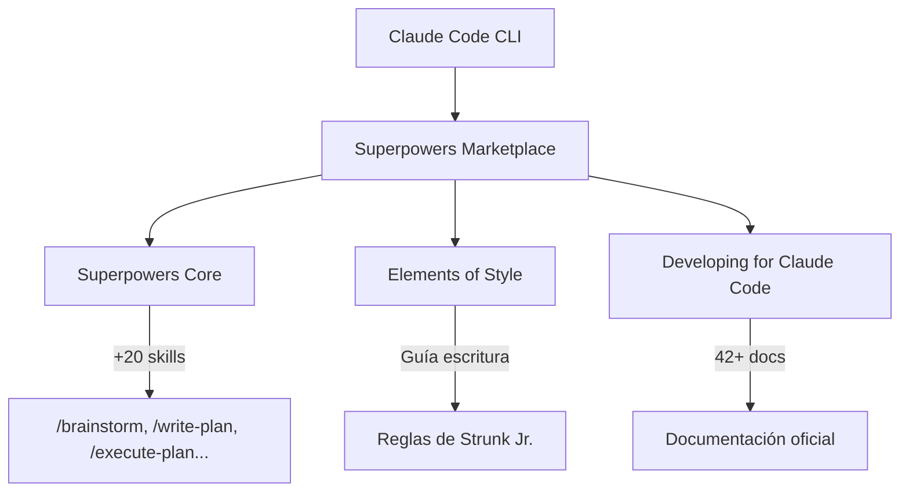
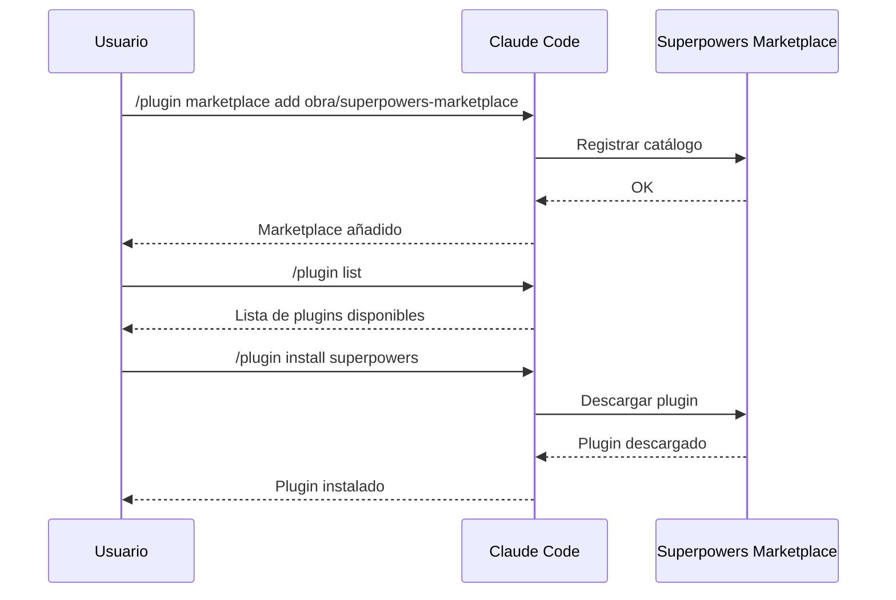

¿Usas Claude Code y sientes que podrías hacer más con él? En este tutorial te muestro cómo instalar **Superpowers Marketplace**, un catálogo de plugins que amplían las capacidades de Claude Code con más de 20 habilidades listas para usar.

## ¿Qué es Claude Code?

Claude Code es la CLI oficial de Anthropic para interactuar con Claude. Te permite ejecutar tareas de programación directamente desde la terminal: escribir código, depurar, refactorizar, y mucho más.

Si ya lo usas, genial. Si no, puedes instalarlo con:

```bash
npm install -g @anthropic-ai/claude-code
```

## ¿Qué es Superpowers Marketplace?

Es un **catálogo curado de plugins** para Claude Code, mantenido por la comunidad. Piensa en él como una tienda de extensiones que añaden comandos y habilidades a tu Claude Code.



## Los 3 plugins principales

### 1. Superpowers (Core)

La biblioteca fundamental. Incluye **más de 20 habilidades probadas** organizadas en categorías:

| Categoría | Ejemplos de comandos |
|-----------|---------------------|
| Planificación | `/brainstorm`, `/write-plan`, `/execute-plan` |
| Testing | Herramientas para pruebas automatizadas |
| Debugging | Análisis y resolución de errores |
| Colaboración | Contexto de sesión compartido |

### 2. Elements of Style

Basado en el clásico "The Elements of Style" de William Strunk Jr. (1918). Proporciona:

- ~12k tokens de referencia
- 18 reglas para escritura clara y concisa
- Cubre gramática, puntuación y composición

Ideal si quieres que Claude te ayude a escribir mejor documentación o artículos técnicos.

### 3. Superpowers: Developing for Claude Code

Recurso especializado para desarrolladores que quieren crear sus propios plugins:

- 42+ archivos de documentación oficial
- Guías para crear plugins, servidores MCP y extensiones
- Mecanismo de auto-actualización

## Instalación paso a paso

### Paso 1: Añadir el marketplace

Primero, abre Claude Code y ejecuta:

```bash
/plugin marketplace add obra/superpowers-marketplace
```

Esto registra el catálogo en tu instalación de Claude Code.

:::message
Si es tu primera vez añadiendo un marketplace, Claude Code te pedirá confirmación. Acepta para continuar.
:::

### Paso 2: Ver plugins disponibles

Una vez añadido el marketplace, puedes ver los plugins disponibles:

```bash
/plugin list
```

Verás algo como:

```
Available plugins from obra/superpowers-marketplace:
  - superpowers (core skills)
  - elements-of-style (writing guidance)
  - superpowers-dev (developer docs)
```

### Paso 3: Instalar un plugin

Instala el plugin que quieras. Por ejemplo, para instalar Superpowers Core:

```bash
/plugin install superpowers
```

### Paso 4: Verificar la instalación

Confirma que el plugin está activo:

```bash
/plugin status
```

¡Felicitaciones! Ya tienes Superpowers instalado.

## Flujo completo de instalación



## Uso práctico: ejemplo con /brainstorm

Una de las habilidades más útiles es `/brainstorm`. Te ayuda a generar ideas estructuradas.

```bash
/brainstorm "Cómo mejorar el onboarding de mi app"
```

Claude generará una lista de ideas organizadas que puedes refinar con `/write-plan` y ejecutar con `/execute-plan`.

## Flujo de trabajo recomendado


## Consejos para sacarle el máximo provecho

1. **Empieza con Superpowers Core** - Es el plugin más versátil y útil para el día a día.

2. **Explora los comandos disponibles** - Después de instalar, usa `/help` para ver todos los comandos nuevos.

3. **Combina habilidades** - Usa `/brainstorm` → `/write-plan` → `/execute-plan` como flujo de trabajo.

4. **Considera Elements of Style** - Si escribes mucha documentación, este plugin mejorará tu prosa técnica.

5. **Mantén actualizado** - Los plugins se actualizan regularmente. Revisa el marketplace de vez en cuando.

## Resumen

En este tutorial cubrimos:

- Qué es Superpowers Marketplace y por qué es útil
- Los 3 plugins principales disponibles
- Cómo instalar el marketplace y los plugins paso a paso
- Un ejemplo práctico con `/brainstorm`
- Consejos para maximizar la productividad

### Enlaces de referencia

- [Repositorio de Superpowers Marketplace](https://github.com/obra/superpowers-marketplace)
- [Documentación oficial de Claude Code](https://docs.anthropic.com/claude-code)

---

¿Ya probaste Superpowers? Me encantaría conocer tu experiencia. ¡Espero que te sea útil!
