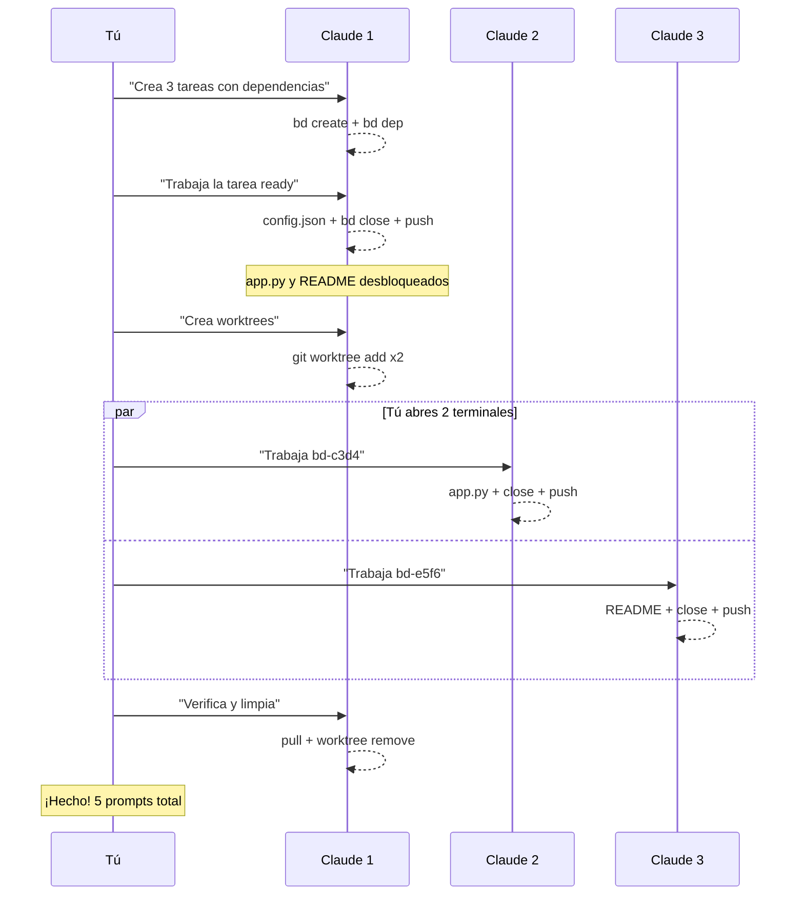

Tienes 3 archivos que crear. Pero el archivo 2 y 3 dependen de que el 1 exista. ¿Cómo paralelizas?

Puedes correr **múltiples agentes Claude en paralelo**, cada uno en su propio espacio de trabajo, compartiendo un backlog común con Beads.

En este tutorial te muestro cómo.

## El Modelo Mental

```
┌─────────────────────────────────────────────────────────────┐
│                    TÚ (Orquestador)                         │
│                                                             │
│   Terminal 1        Terminal 2        Terminal 3            │
│   worktree-a        worktree-b        worktree-c            │
│   ┌─────────┐       ┌─────────┐       ┌─────────┐           │
│   │ Claude  │       │ Claude  │       │ Claude  │           │
│   │ bd-001  │       │ bd-002  │       │ bd-003  │           │
│   └────┬────┘       └────┬────┘       └────┬────┘           │
│        │                 │                 │                │
│        └────────────┬────┴─────────────────┘                │
│                     ▼                                       │
│            .beads/issues.jsonl                              │
│            (backlog compartido via git)                     │
└─────────────────────────────────────────────────────────────┘
```

**Puntos clave:**

1. **Tú orquestas** — Claude no crea subagentes automáticamente
2. **Cada Claude tiene su worktree** — Sin conflictos de archivos
3. **Beads sincroniza via git** — El backlog es compartido
4. **IDs hash (`bd-a1b2`)** — Evitan colisiones de merge

## Prerequisitos

- Claude Code instalado
- Beads inicializado en tu repo (`bd init`)

## El Escenario

Queremos crear 3 archivos:

| Archivo | Dependencia |
|---------|-------------|
| `config.json` | Ninguna (se puede hacer primero) |
| `app.py` | Necesita que `config.json` exista |
| `README.md` | Necesita que `config.json` exista |

**El archivo 1 es bloqueante.** Los archivos 2 y 3 pueden hacerse en paralelo una vez que el 1 esté listo.

## Paso 1: Dile a Claude que Cree el Backlog

Abre Claude Code y dile:

```
Crea 3 tareas en Beads:
1. Crear config.json (sin dependencias)
2. Crear app.py (bloqueado por la tarea 1)
3. Crear README.md (bloqueado por la tarea 1)

Luego muéstrame qué está ready.
```

Claude ejecuta:

```bash
bd create "Crear config.json" -p 1
bd create "Crear app.py" -p 1
bd dep add bd-c3d4 bd-a1b2 blocks
bd create "Crear README.md" -p 1
bd dep add bd-e5f6 bd-a1b2 blocks
bd ready
```

```
Ready tasks:
  bd-a1b2: Crear config.json (P1)

Blocked:
  bd-c3d4: Crear app.py (blocked by bd-a1b2)
  bd-e5f6: Crear README.md (blocked by bd-a1b2)
```

**Solo `config.json` está ready.** Las otras dos esperan.

## Paso 2: Claude Completa la Tarea Base

Le dices:

```
Trabaja en la tarea que está ready. Reclámala, créala, ciérrala y sincroniza.
```

Claude ejecuta todo:

```bash
bd update bd-a1b2 in_progress

cat > config.json << 'EOF'
{
  "app_name": "Mi Proyecto",
  "version": "1.0.0",
  "debug": true
}
EOF

bd close bd-a1b2 "config.json creado"
bd sync
git push
bd ready
```

```
Ready tasks:
  bd-c3d4: Crear app.py (P1)      ← ¡desbloqueado!
  bd-e5f6: Crear README.md (P1)   ← ¡desbloqueado!
```

## Paso 3: Claude Crea los Worktrees

Ahora hay 2 tareas ready. Le dices:

```
Hay 2 tareas ready. Crea 2 git worktrees para que pueda 
lanzar Claudes en paralelo. Uno para app.py y otro para README.
```

Claude ejecuta:

```bash
git worktree add ../proyecto-app main
git worktree add ../proyecto-docs main
echo "Worktrees creados:"
echo "  Terminal 1: cd ../proyecto-app && claude"
echo "  Terminal 2: cd ../proyecto-docs && claude"
```

**Tú abres 2 terminales nuevas:**

```bash
# Terminal 1
cd ../proyecto-app && claude

# Terminal 2  
cd ../proyecto-docs && claude
```

## Paso 4: Cada Claude Trabaja su Tarea

### Terminal 1 (a Claude le dices):

```
Trabaja en la tarea bd-c3d4 (app.py). Reclámala, implémentala, 
ciérrala y sincroniza.
```

Claude hace todo solo:

```bash
bd update bd-c3d4 in_progress

cat > app.py << 'EOF'
import json

with open('config.json') as f:
    config = json.load(f)

print(f"Running {config['app_name']} v{config['version']}")
EOF

bd close bd-c3d4 "app.py creado"
bd sync
git push
```

### Terminal 2 (a Claude le dices):

```
Trabaja en la tarea bd-e5f6 (README). Reclámala, implémentala,
ciérrala y sincroniza.
```

Claude hace todo solo:

```bash
bd update bd-e5f6 in_progress

cat > README.md << 'EOF'
# Mi Proyecto

Configuración en `config.json`.

## Uso
python app.py
EOF

bd close bd-e5f6 "README.md creado"
bd sync
git push
```

**Ambos trabajan en paralelo. Tú solo esperas.**

## Paso 5: Verificar y Limpiar

De vuelta en el Claude original, le dices:

```
Haz pull, muéstrame el estado de las tareas, y limpia los worktrees.
```

Claude ejecuta:

```bash
git pull
bd list --all
ls
git worktree remove ../proyecto-app
git worktree remove ../proyecto-docs
```

```
✓ bd-a1b2: Crear config.json (closed)
✓ bd-c3d4: Crear app.py (closed)
✓ bd-e5f6: Crear README.md (closed)

config.json  app.py  README.md
```

**¡3 archivos creados, 2 en paralelo, hands-off!**

## El Flujo Visualizado



## Tips Rápidos

| Tip | Por qué |
|-----|---------|
| `bd dep add B A blocks` | Declara que B depende de A |
| `bd update ID in_progress` | "Reclama" la tarea para evitar duplicados |
| `bd sync && git push` | El trabajo no existe hasta que está en remote |
| `bd hooks install` | Auto-sync en pre-push y post-merge |

## Resumen: 5 Prompts y Listo

| Paso | Prompt a Claude |
|------|-----------------|
| 1 | "Crea 3 tareas: config.json (base), app.py y README (dependen de la primera)" |
| 2 | "Trabaja la tarea ready, ciérrala y sincroniza" |
| 3 | "Crea 2 worktrees para las tareas desbloqueadas" |
| 4a | (Terminal 1) "Trabaja bd-c3d4, ciérrala y sincroniza" |
| 4b | (Terminal 2) "Trabaja bd-e5f6, ciérrala y sincroniza" |
| 5 | "Haz pull, verifica y limpia los worktrees" |

**El humano da 5 prompts. Claude hace todo lo demás.**

---

¿Has probado este flujo? Me encantaría saber cómo escalas tu productividad con múltiples agentes.
