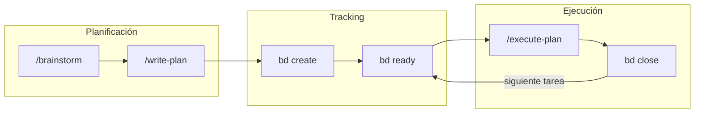
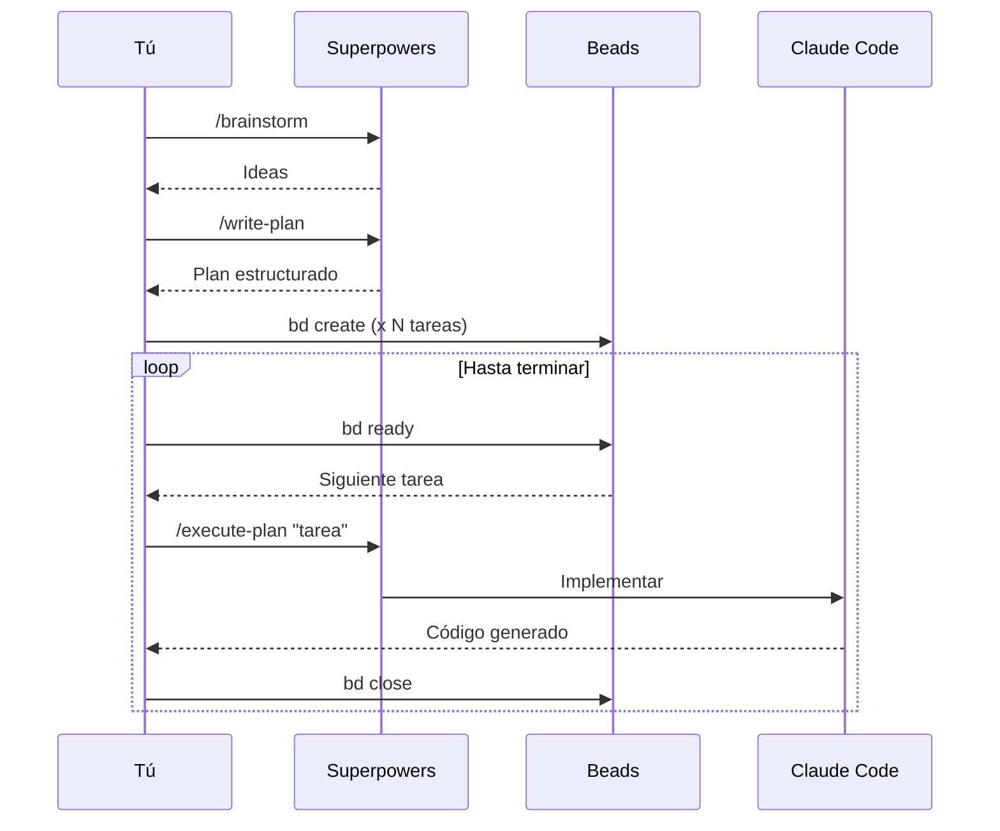

¿Quieres ver cómo se siente desarrollar con Claude Code usando **Beads** para gestionar tareas y **Superpowers** para planificar? En este artículo te muestro el flujo completo construyendo un chatbot como ejemplo.

## El reto

Crear un chatbot conversacional con LangGraph + Chainlit + Azure OpenAI.

No importa tanto el código — lo interesante es **cómo organizamos el trabajo** con estas herramientas.

## La sinergia: Beads + Superpowers



| Herramienta | Rol |
|-------------|-----|
| **Superpowers** | Planificar: generar ideas, estructurar, ejecutar |
| **Beads** | Trackear: qué falta, qué bloquea qué, qué se completó |

## Setup rápido

```bash
# Superpowers
/plugin marketplace add obra/superpowers-marketplace
/plugin install superpowers

# Beads
curl -fsSL https://raw.githubusercontent.com/steveyegge/beads/main/scripts/install.sh | bash
bd setup claude
```

## Paso 1: Brainstorm

Empezamos explorando el problema:

```
/brainstorm "Crear un chatbot conversacional con LangGraph + Chainlit + Azure OpenAI"
```

Claude genera ideas estructuradas:

```
1. Definir estructura del proyecto
2. Configurar dependencias
3. Implementar backend (LangGraph)
4. Crear UI (Chainlit)
5. Conectar con Azure OpenAI
6. Probar
```

## Paso 2: Write Plan

Convertimos las ideas en un plan:

```
/write-plan "Chatbot LangGraph"
```

```markdown
## Plan: Chatbot LangGraph

### Fase 1: Setup
- [ ] Crear estructura de directorios
- [ ] Configurar pyproject.toml

### Fase 2: Backend
- [ ] Implementar grafo LangGraph
- [ ] Configurar Azure OpenAI

### Fase 3: Frontend
- [ ] Crear app Chainlit

### Fase 4: Testing
- [ ] Probar flujo completo
```

## Paso 3: Registrar en Beads

El plan pasa a ser **tareas trackeables**:

```bash
bd init --quiet

bd create "Crear estructura de directorios" -p 1
bd create "Configurar pyproject.toml" -p 1
bd create "Implementar grafo LangGraph" -p 2
bd create "Configurar Azure OpenAI" -p 2
bd create "Crear app Chainlit" -p 3
bd create "Probar flujo completo" -p 4
```

Ver qué está listo:

```bash
bd ready
```

```
Ready tasks:
  bd-001: Crear estructura de directorios (priority: 1)
  bd-002: Configurar pyproject.toml (priority: 1)
```

## Paso 4: Execute Plan (loop)

Ahora el ciclo de trabajo:

```bash
# Ver siguiente tarea
bd ready

# Ejecutar con Claude Code
/execute-plan "Crear estructura del proyecto ..."

# Resultado:
#   backend/
#   ├── chainlit_app.py           # UI Chainlit
#   ├── src/
#   │   ├── __init__.py
#   │   └── agents/
#   │       ├── __init__.py       # Exports públicos
#   │       ├── state.py          # Definición de estados
#   │       ├── tools.py          # LLM y herramientas
#   │       └── agent.py          # Definición del grafo
#   ├── pyproject.toml
#   └── .env.example


# Marcar completado
bd close bd-001 --reason "Estructura creada"
```

Repetir para cada tarea:

```bash
bd ready
/execute-plan "Configurar pyproject.toml con UV"
bd close bd-002 --reason "Dependencias configuradas"

bd ready
/execute-plan "Implementar grafo LangGraph básico"
bd close bd-003 --reason "Grafo implementado"

# ... y así sucesivamente
```

## El flujo visualizado



## Verificar progreso

En cualquier momento:

```bash
# Ver todo
bd list --all

# Ver solo pendientes
bd ready

# Ver una tarea específica
bd show bd-003
```

## Por qué funciona

1. **Superpowers estructura el "qué hacer"** — No empiezas en blanco.

2. **Beads persiste el estado** — Si cierras Claude Code, mañana sabes exactamente dónde quedaste.

3. **El ciclo es claro** — `bd ready` → `/execute-plan` → `bd close` → repetir.

4. **El estado vive fuera del prompt** — No dependes de que Claude "recuerde" el plan.

## Tips prácticos

- **Empieza siempre con /brainstorm** — Te da claridad.
- **Convierte el plan en Beads inmediatamente** — No dejes el plan en un Markdown suelto.
- **Una tarea = una unidad cerrable** — Si es muy grande, divídela.
- **Usa `bd ready` como tu "qué sigue"** — No pienses, ejecuta lo que está listo.

## Resumen

```
/brainstorm → /write-plan → bd create → [bd ready → /execute-plan → bd close] × N
```

La sinergia de Beads + Superpowers te da un flujo **estructurado y persistente**. El código que escribas es lo de menos — lo importante es que nunca pierdes el hilo.

### Enlaces

- [Superpowers Marketplace](https://github.com/obra/superpowers-marketplace)
- [Beads](https://github.com/steveyegge/beads)

---

¿Has probado este flujo? Me encantaría saber cómo te va.
