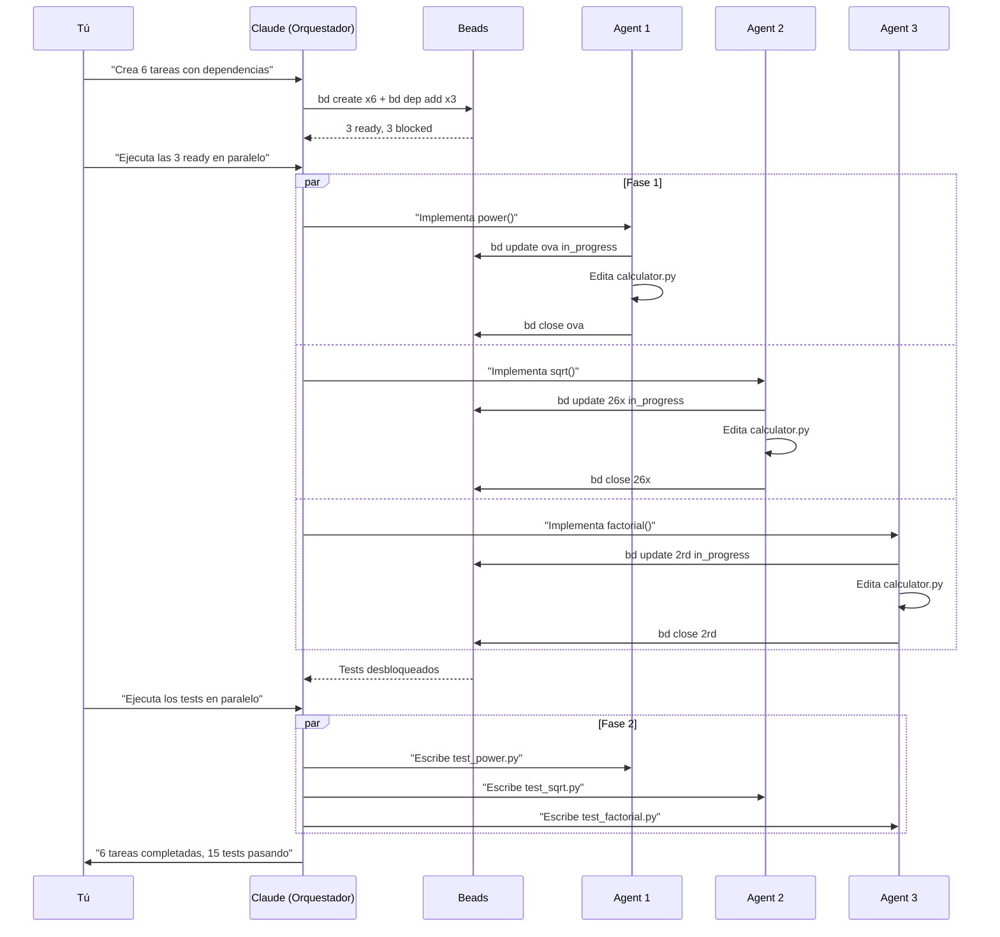

Tienes 6 tareas. Las primeras 3 son independientes. Las otras 3 dependen de que las primeras terminen. ¿Cómo las ejecutas en paralelo respetando las dependencias?

**Beads** trackea el backlog y las dependencias. **Task tool** ejecuta en paralelo. Juntos son imparables.

En este tutorial lo hacemos paso a paso con código real.

## El Escenario

Tenemos un módulo `calculator.py` con 4 operaciones básicas. Queremos agregar 3 más:

| Tarea | Dependencia |
|-------|-------------|
| Implementar `power()` | Ninguna |
| Implementar `sqrt()` | Ninguna |
| Implementar `factorial()` | Ninguna |
| Tests para `power()` | Necesita que `power()` exista |
| Tests para `sqrt()` | Necesita que `sqrt()` exista |
| Tests para `factorial()` | Necesita que `factorial()` exista |

```
Fase 1 (paralelo):     Fase 2 (paralelo, después de Fase 1):
┌─────────┐            ┌─────────────┐
│ power() │ ─────────▶ │ test_power  │
└─────────┘            └─────────────┘
┌─────────┐            ┌─────────────┐
│ sqrt()  │ ─────────▶ │ test_sqrt   │
└─────────┘            └─────────────┘
┌─────────┐            ┌─────────────┐
│factorial│ ─────────▶ │test_factorial│
└─────────┘            └─────────────┘
```

## Prerequisitos

```bash
# Instalar beads
go install github.com/steveyegge/beads/cmd/bd@latest

# Inicializar en tu repo
bd init
```

## Paso 1: Crear el Proyecto Base

Primero, el código que vamos a extender:

```python
# src/calculator.py
"""Simple calculator module."""

def add(a: float, b: float) -> float:
    return a + b

def subtract(a: float, b: float) -> float:
    return a - b

def multiply(a: float, b: float) -> float:
    return a * b

def divide(a: float, b: float) -> float:
    if b == 0:
        raise ValueError("Cannot divide by zero")
    return a / b

# TODO: power, sqrt, factorial
```

Y tests básicos que ya pasan:

```python
# tests/test_basic.py
import pytest
from calculator import add, subtract, multiply, divide

def test_add():
    assert add(2, 3) == 5

def test_divide_by_zero():
    with pytest.raises(ValueError):
        divide(1, 0)
```

## Paso 2: Crear el Backlog en Beads

Le dices a Claude:

```
Crea 6 tareas en Beads:
1. Implementar power(base, exp) - P1
2. Implementar sqrt(n) - P1
3. Implementar factorial(n) - P1
4. Tests para power - P2, bloqueado por tarea 1
5. Tests para sqrt - P2, bloqueado por tarea 2
6. Tests para factorial - P2, bloqueado por tarea 3

Luego muéstrame qué está ready.
```

Claude ejecuta:

```bash
# Crear tareas de implementación
bd create "Implement power(base, exp) function" -p 1
bd create "Implement sqrt(n) function" -p 1
bd create "Implement factorial(n) function" -p 1

# Crear tareas de tests
bd create "Write tests for power function" -p 2
bd create "Write tests for sqrt function" -p 2
bd create "Write tests for factorial function" -p 2

# Agregar dependencias (tests bloqueados por implementaciones)
bd dep add dev-vibe-app-qu8 dev-vibe-app-ova --type blocks
bd dep add dev-vibe-app-8yp dev-vibe-app-26x --type blocks
bd dep add dev-vibe-app-f9s dev-vibe-app-2rd --type blocks

# Ver qué está listo
bd ready
```

Output:

```
📋 Ready work (3 issues with no blockers):

1. [● P1] dev-vibe-app-ova: Implement power(base, exp) function
2. [● P1] dev-vibe-app-26x: Implement sqrt(n) function
3. [● P1] dev-vibe-app-2rd: Implement factorial(n) function

Blocked:
  dev-vibe-app-qu8: Write tests for power (blocked by ova)
  dev-vibe-app-8yp: Write tests for sqrt (blocked by 26x)
  dev-vibe-app-f9s: Write tests for factorial (blocked by 2rd)
```

**3 tareas ready, 3 bloqueadas.** Exactamente lo que queremos.

## Paso 3: Ejecutar Fase 1 en Paralelo

Le dices a Claude:

```
Lanza 3 agentes en paralelo para implementar las funciones ready.
Cada agente debe:
1. Reclamar su tarea con bd update ID in_progress
2. Implementar la función
3. Cerrar con bd close ID "mensaje"
```

Claude lanza 3 Task tools simultáneos:

```
┌──────────────────────────────────────────────────────────┐
│                    Claude (Orquestador)                   │
│                                                          │
│  ┌─────────────┐  ┌─────────────┐  ┌─────────────┐      │
│  │  Agent 1    │  │  Agent 2    │  │  Agent 3    │      │
│  │  power()    │  │  sqrt()     │  │ factorial() │      │
│  │             │  │             │  │             │      │
│  │ bd update   │  │ bd update   │  │ bd update   │      │
│  │ edit file   │  │ edit file   │  │ edit file   │      │
│  │ bd close    │  │ bd close    │  │ bd close    │      │
│  └─────────────┘  └─────────────┘  └─────────────┘      │
│         │                │                │              │
│         └────────────────┼────────────────┘              │
│                          ▼                               │
│                   Resultados                             │
└──────────────────────────────────────────────────────────┘
```

Cada agente trabaja independientemente. Resultado después de ~30 segundos:

```python
# calculator.py ahora tiene:

def power(base: float, exp: float) -> float:
    """Calculate base raised to the power of exp."""
    return base ** exp

def sqrt(n: float) -> float:
    """Calculate the square root of n."""
    if n < 0:
        raise ValueError("Cannot calculate square root of negative number")
    return n ** 0.5

def factorial(n: int) -> int:
    """Calculate the factorial of n."""
    if n < 0:
        raise ValueError("Cannot calculate factorial of negative number")
    if n == 0 or n == 1:
        return 1
    result = 1
    for i in range(2, n + 1):
        result *= i
    return result
```

Verificamos beads:

```bash
bd ready
```

```
📋 Ready work (3 issues with no blockers):

1. [● P2] dev-vibe-app-qu8: Write tests for power function
2. [● P2] dev-vibe-app-8yp: Write tests for sqrt function
3. [● P2] dev-vibe-app-f9s: Write tests for factorial function
```

**Las tareas de tests se desbloquearon automáticamente.**

## Paso 4: Ejecutar Fase 2 en Paralelo

Le dices a Claude:

```
Ahora hay 3 tareas de tests ready. Lanza 3 agentes en paralelo.
Cada uno debe crear su archivo de tests y cerrar su tarea.
```

Claude lanza otros 3 agentes. Resultado:

```
tests/
├── test_basic.py      (existía)
├── test_power.py      (nuevo - Agent 4)
├── test_sqrt.py       (nuevo - Agent 5)
└── test_factorial.py  (nuevo - Agent 6)
```

## Paso 5: Verificar

```bash
# Correr todos los tests
pytest tests/ -v
```

```
tests/test_basic.py::test_add PASSED
tests/test_basic.py::test_subtract PASSED
tests/test_basic.py::test_multiply PASSED
tests/test_basic.py::test_divide PASSED
tests/test_basic.py::test_divide_by_zero PASSED
tests/test_factorial.py::test_factorial_zero PASSED
tests/test_factorial.py::test_factorial_one PASSED
tests/test_factorial.py::test_factorial_five PASSED
tests/test_factorial.py::test_factorial_negative PASSED
tests/test_power.py::test_basic_power_operations PASSED
tests/test_power.py::test_negative_exponents PASSED
tests/test_power.py::test_fractional_exponents PASSED
tests/test_sqrt.py::test_sqrt_basic PASSED
tests/test_sqrt.py::test_sqrt_zero PASSED
tests/test_sqrt.py::test_sqrt_negative_raises_error PASSED

============================== 15 passed ==============================
```

```bash
# Ver estado final de beads
bd list --all
```

```
✓ dev-vibe-app-2rd [P1] - Implement factorial(n) function
✓ dev-vibe-app-26x [P1] - Implement sqrt(n) function
✓ dev-vibe-app-ova [P1] - Implement power(base, exp) function
✓ dev-vibe-app-f9s [P2] - Write tests for factorial function
✓ dev-vibe-app-8yp [P2] - Write tests for sqrt function
✓ dev-vibe-app-qu8 [P2] - Write tests for power function
```

**6 tareas cerradas. 15 tests pasando. 6 agentes usados.**

## El Flujo Completo



## Cuándo Usar Este Patrón

| Usa Task tool + Beads cuando... | Usa solo Task tool cuando... |
|--------------------------------|------------------------------|
| Hay dependencias entre tareas | Todas las tareas son independientes |
| Quieres persistir el backlog | Es trabajo de una sola sesión |
| Necesitas auditar quién hizo qué | No necesitas trazabilidad |
| El trabajo puede interrumpirse | Puedes terminar todo de una vez |

## Tips

### 1. Cada Agente, Su Archivo

Los agentes no pueden editar el mismo archivo simultáneamente. Diseña las tareas para que cada uno toque archivos diferentes.

```diff
- Agent 1: Edita utils.py línea 10
- Agent 2: Edita utils.py línea 50
  ↑ CONFLICTO

+ Agent 1: Crea test_power.py
+ Agent 2: Crea test_sqrt.py
  ↑ OK, archivos separados
```

### 2. bd ready Es Tu Semáforo

Antes de lanzar agentes, siempre corre `bd ready`. Solo trabaja lo que está desbloqueado.

### 3. Cierra Tareas Inmediatamente

Cada agente debe cerrar su tarea (`bd close`) antes de terminar. Si no, la tarea queda en `in_progress` y bloquea las dependientes.

### 4. Verifica Después de Cada Fase

```bash
bd ready           # ¿Qué se desbloqueó?
pytest tests/ -v   # ¿Pasan los tests?
bd list --all      # ¿Estado general?
```

## Resumen

```
┌─────────────────────────────────────────────────────────┐
│                El Patrón Task + Beads                   │
│                                                         │
│  1. bd create + bd dep add    → Define el grafo        │
│  2. bd ready                  → Ve qué está listo      │
│  3. Task tool (paralelo)      → Ejecuta lo ready       │
│  4. bd close                  → Marca completado       │
│  5. Repite desde paso 2       → Hasta terminar         │
│                                                         │
│  Beads = QUÉ hacer (backlog + dependencias)            │
│  Task  = CÓMO hacerlo (ejecución paralela)             │
└─────────────────────────────────────────────────────────┘
```

3 prompts. 6 agentes. 15 tests. Cero fricción.

---

¿Probaste este flujo? Me encantaría saber cómo lo adaptas a tu proyecto.
