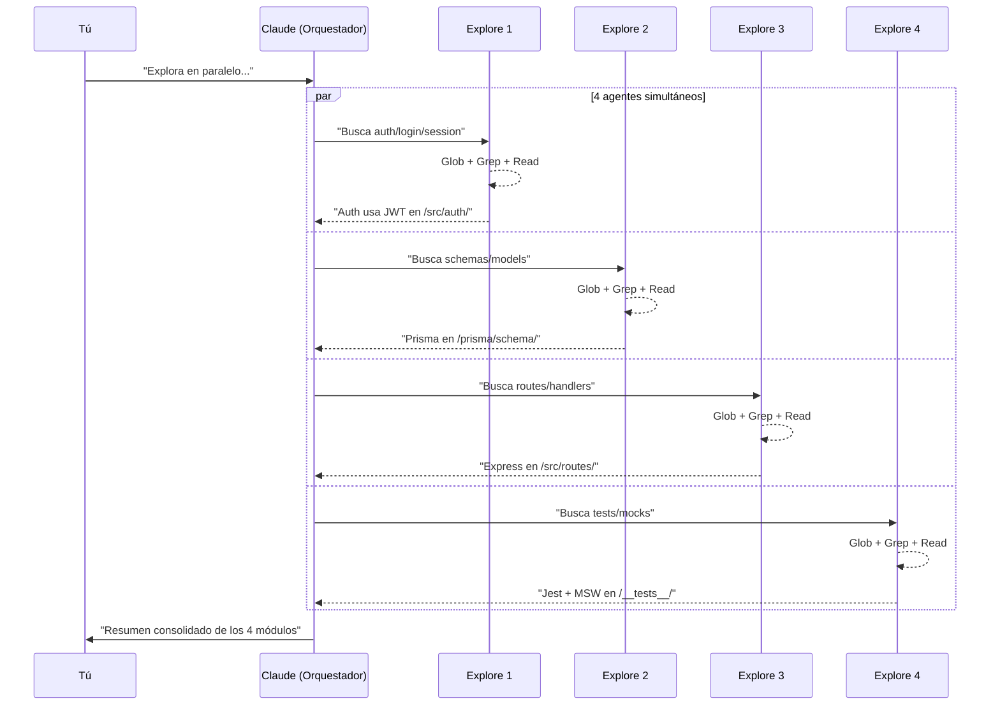

Quieres investigar 4 módulos de tu codebase. ¿Esperas a que Claude termine uno por uno? No. Lanzas 4 subagentes en paralelo y recibes los resultados en el tiempo que toma el más lento.

Así funciona el **Task tool** de Claude Code.

## Task Tool vs Worktrees: Cuándo Usar Cada Uno

```
┌─────────────────────────────────────────────────────────────┐
│                      ¿Qué necesitas?                        │
│                                                             │
│   ┌─────────────────┐         ┌─────────────────┐          │
│   │  Investigar /   │         │  Editar mismos  │          │
│   │  leer / buscar  │         │    archivos     │          │
│   └────────┬────────┘         └────────┬────────┘          │
│            │                           │                    │
│            ▼                           ▼                    │
│     ┌────────────┐              ┌────────────┐             │
│     │ Task Tool  │              │ Worktrees  │             │
│     │ (built-in) │              │ + Beads    │             │
│     └────────────┘              └────────────┘             │
└─────────────────────────────────────────────────────────────┘
```

| Aspecto | Task Tool | Worktrees + Beads |
|---------|-----------|-------------------|
| Setup | Ninguno (built-in) | `bd init` + crear worktrees |
| Quién orquesta | Claude automático | Tú manualmente |
| Persistencia | Solo en la sesión | Entre sesiones |
| Editar archivos | Uno a la vez | Cada worktree aislado |
| Límite paralelo | 10 simultáneos | Ilimitado (RAM) |

**Regla simple**: Si solo necesitas *leer*, usa Task tool. Si necesitas *escribir* en paralelo, usa worktrees.

## Los Tipos de Subagente

Claude Code tiene subagentes especializados. Cada uno tiene acceso a herramientas específicas:

| Tipo | Para qué | Herramientas |
|------|----------|--------------|
| `Explore` | Explorar codebase, buscar patrones | Glob, Grep, Read |
| `Plan` | Diseñar arquitectura, planificar | Todas |
| `Bash` | Ejecutar comandos, git, npm | Solo Bash |
| `general-purpose` | Tareas complejas multi-paso | Todas |

## Ejemplo 1: Exploración Paralela

Quieres entender un codebase nuevo. En vez de explorar módulo por módulo, lanzas 4 agentes:

```
Explora este codebase usando 4 tareas en paralelo:
1. Sistema de autenticación (auth, login, session)
2. Modelos de datos (schemas, models, entities)
3. API endpoints (routes, controllers, handlers)
4. Patrones de testing (tests, specs, mocks)

Cada agente debe reportar: archivos clave, patrones usados, y dependencias.
```

**Lo que pasa internamente:**



**Tiempo**: ~30 segundos (paralelo) vs ~2 minutos (secuencial)

## Ejemplo 2: Investigación de Bug

Tienes un bug que puede estar en frontend, backend, o base de datos:

```
Tengo un bug: los usuarios ven datos desactualizados después de actualizar su perfil.

Lanza 3 agentes en paralelo para investigar:
1. Frontend: busca cómo se maneja el cache/estado después de un PUT
2. Backend: verifica si el endpoint de update retorna los datos actualizados
3. Database: revisa si hay triggers o delays en las queries

Cada agente debe reportar: archivos relevantes, hipótesis, y evidencia.
```

## Ejemplo 3: Code Review Paralelo

Tienes un PR grande. Divídelo por áreas:

```
Revisa este PR (#42) en paralelo:
1. Agente de seguridad: busca vulnerabilidades (injection, XSS, auth bypass)
2. Agente de performance: identifica N+1 queries, loops innecesarios
3. Agente de estilo: verifica consistencia con el resto del codebase

Cada agente escribe sus findings en un archivo separado.
```

## Ejemplo 4: Documentación Masiva

Tienes 10 funciones sin documentar:

```
Documenta estas funciones en paralelo. Cada agente toma 2-3 funciones:
- src/utils/auth.ts: validateToken, refreshToken, revokeToken
- src/utils/cache.ts: getCache, setCache, invalidateCache
- src/utils/logger.ts: logInfo, logError, logDebug

Genera JSDoc con descripción, params, returns, y ejemplo.
```

## Best Practices

### 1. Sé Específico en el Prompt

```diff
- "Explora el código"
+ "Busca todos los archivos que manejan autenticación,
+  lista los patrones usados (JWT, session, OAuth),
+  y reporta las dependencias externas"
```

### 2. Tareas Disjuntas

Los agentes no pueden ver el trabajo de otros. Asegúrate de que cada tarea sea independiente:

```diff
- Agente 1: Escribe función A
- Agente 2: Escribe función B que usa A  ← ¡NO! B depende de A

+ Agente 1: Investiga módulo auth
+ Agente 2: Investiga módulo cache  ← OK, son independientes
```

### 3. Serializa lo Riesgoso

```
# Paralelo (safe): investigación
Lanza 4 agentes para explorar el codebase...

# Secuencial (safe): implementación
Ahora, basándote en los hallazgos, implementa los cambios uno por uno...
```

### 4. Usa el Modelo Correcto

Para tareas simples, especifica un modelo más rápido:

```
Usa 4 agentes Haiku para buscar todas las TODOs en el codebase.
```

### 5. Background para Tareas Largas

Si una tarea toma tiempo, ejecútala en background:

```
Lanza un agente en background para analizar la cobertura de tests.
Mientras tanto, continuemos con el refactor.
```

## Límites Técnicos

| Límite | Valor |
|--------|-------|
| Agentes simultáneos | 10 máximo |
| Contexto por agente | ~200k tokens |
| Overhead inicial | ~20k tokens |
| Comunicación entre agentes | No directa (via orquestador) |

## Cuándo NO Usar Task Tool

1. **Edición de archivos** - Los agentes no deben editar el mismo archivo
2. **Tareas con dependencias** - Si B necesita que A termine, hazlo secuencial
3. **Estado compartido** - Los agentes no comparten memoria
4. **Tareas triviales** - El overhead no vale para algo que toma 5 segundos

## Resumen

```
┌─────────────────────────────────────────────────┐
│           Checklist: ¿Task Tool?                │
│                                                 │
│  ✓ ¿Son tareas de lectura/investigación?       │
│  ✓ ¿Son independientes entre sí?               │
│  ✓ ¿Valen >30 segundos cada una?               │
│  ✓ ¿Son menos de 10?                           │
│                                                 │
│  Si todas son SÍ → Task Tool                   │
│  Si alguna es NO → Secuencial o Worktrees      │
└─────────────────────────────────────────────────┘
```

El Task tool es tu multiplicador de productividad para investigación. Úsalo cada vez que necesites "mirar en varios lugares a la vez".

---

¿Quieres que te muestre cómo combinar Task tool con Beads para flujos más complejos?

## Sources

- [Claude Code: Best practices for agentic coding](https://www.anthropic.com/engineering/claude-code-best-practices)
- [Create custom subagents - Claude Code Docs](https://code.claude.com/docs/en/sub-agents)
- [How to Use Claude Code Subagents to Parallelize Development](https://zachwills.net/how-to-use-claude-code-subagents-to-parallelize-development/)
- [How we built our multi-agent research system](https://www.anthropic.com/engineering/multi-agent-research-system)
